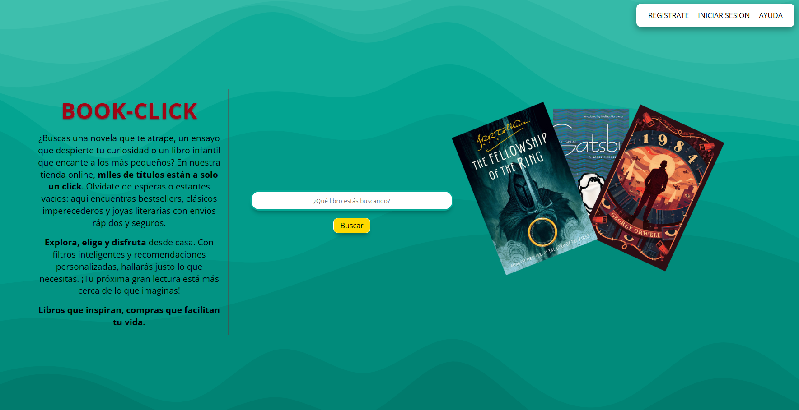

# Book-Click Landing Page.

Este es un proyecto en el cual cree mi primera landing page de una librería ficticia, utilice `flexbox`, `media queries` para crear un diseño que funciona bien en pantallas móviles y de escritorio, así como una ventana de `alert` con un mensaje gracias a`Javascript`.

La página cuenta con descripción de la tienda, así como una barra de búsqueda en la cual puedes buscar un libro. Lo que te mostrará una alerta, Igualmente, si no introduces nada en la barra y haces click en el botón, recibirás un mensaje.

---

## 📌 ¿Por qué hice este proyecto?

Quise aplicar todo lo que he aprendido hasta ahora de forma práctica y agregar un poco de `Javascript` para que el usuario tenga un poco de interactividad al realizar una búsqueda.

---

## 🖼️ Vista previa
 
- 📱 El diseño se adapta a diferentes tamaños de pantalla gracias al uso de Flexbox y Media Queries  
- 💻 En pantallas grandes, los paneles se muestran en fila  
- 📱 En móviles, se muestran en columna

---

## 🛠️ Conocimientos aplicados

- HTML básico (estructura, etiquetas, listas, enlaces, imágenes)
- CSS (colores, fuentes, espaciados, bordes)
- Flexbox (alineación y distribución de elementos)
- Media Queries (diseño adaptable)
- Google Fonts
- Pseudoclases (`:hover`, `:focus`)
- Diseño responsivo
- JavaScript (`Funciones`)

---

## 
Jonathan.